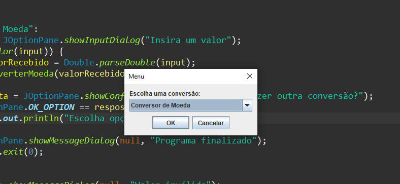

<h1 align="center"> Conversor de moedas e temperatura </h1>

Challenge ONE Back End - Java.

Sprint 01: Crie seu próprio conversor de moeda.

 

  

## 🚀 Tecnologias

Esse projeto foi desenvolvido com as seguintes tecnologias:

- Java 

## 💻 Projeto

Uma aplicação que converte moedas e temperaturas, assim você pode saber quanto que é reais para dolares por exemplo, e quanto que é graus Celcius para Fahrenheit por exemplo...
